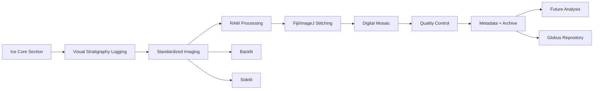

# Standardizing Quantitative Visual Stratigraphy for Digital Archiving of Ice Cores

**Authors:** Gary Hoehne, Grayton Simanson  
**Advisors:** Richard Nunn, Curt LaBombard  
**Development Dataset:** AH2416, Allan Hills Blue Ice Area, Antarctica  
**Program:** NSF COLDEX Research Experience for Undergraduates (REU)

---

## 📂 Conference Resources
* 📄 **[Download Full-Resolution Digital Poster (PDF)](COLDEX_AllanHills_Poster.pdf)**
* 💼 **[Connect with [Your Name] on LinkedIn](https://linkedin.com)**
* 💼 **[Connect with Grayton Simanson on LinkedIn](https://linkedin.com)**

This repository contains:
- Workflow documentation
- Example visual stratigraphy logs
- Metadata templates
- Example processed mosaics
---

## 📝 Introduction
Ice cores preserve continuous records of past environmental and climatic conditions through variations in ice structure, chemistry, and physical properties. Visual stratigraphy represents one of the most fundamental datasets collected from an ice core, documenting features including annual layering, bubble distribution, fractures, dust horizons, melt features, and other englacial structures. These observations provide important context for interpreting complementary measurements, including electrical conductivity measurements (ECM), stable isotope analyses, geochemical measurements, and hyperspectral imaging (HSI).

Despite its importance, standardized high-resolution visual documentation is not consistently available for archived ice cores, limiting opportunities for future analysis and integration with emerging analytical techniques. While advanced methods such as ECM and HSI provide valuable physical and spectral characterization, these approaches require specialized instrumentation and resources that may not be available at all ice core repositories.

This workflow presents a low-cost, reproducible approach for digitally documenting ice cores using commercially available digital photography equipment and open-source image processing software. The workflow was developed using archived ice core AH2416 from the Allan Hills Blue Ice Area, Antarctica, and integrates dual-illumination imaging, calibrated image acquisition, digital image processing, mosaic generation, and manual stratigraphic logging. The objective of this workflow is to provide a standardized framework for producing spatially continuous, depth-referenced visual records of ice cores that can support long-term digital archiving, visual interpretation, and future quantitative analysis.

---

- Manual visual stratigraphy logging
- Standardized digital photography
- Dual-illumination imaging
- RAW image processing
- Digital mosaic generation
- Metadata documentation
- Long-term archival preparation

Although developed using archived ice core material, this workflow is designed to be adaptable for both archived ice cores and newly collected core sections.

The objective of this workflow is to create spatially continuous, depth-referenced visual records of ice cores that support long-term digital preservation, visual interpretation, and future quantitative analysis.

---

# Workflow Overview
---

# 1. Ice Core Preparation and Visual Stratigraphy Documentation

## 1.1 Core Preparation

Archived ice core sections were removed from storage and prepared for visual examination and imaging.

The core section was positioned with the flat surface facing upward on the imaging stage. The core orientation was maintained throughout visual documentation and imaging to preserve spatial relationships between physical observations and digital products.

Prior to imaging, the fluorescent light table was allowed to warm for approximately 10 minutes to stabilize illumination conditions.

Visual stratigraphy observations were completed during this stabilization period to maximize workflow efficiency while ensuring consistent imaging conditions.

---

# 1.2 Manual Visual Stratigraphy Logging

Visual stratigraphy was documented using standardized one-meter core logs with observations recorded at a 1 mm depth resolution.

The purpose of manual logging was to create a structured record of visible ice properties that could later be associated with digital mosaics and complementary datasets.

Each observation included:

- Core identification
- Core section number
- Tube number
- Depth interval
- Feature type
- Feature description
- Approximate size
- Shape and orientation
- Distribution within the ice section
- Additional notes

**[Add Table: Visual Stratigraphy Logging Fields]**

---

# 1.3 Documented Ice Features

The following visual properties were recorded:

## Inclusions

Inclusions were documented based on:

- Depth location
- Approximate size
- Shape and geometry
- Distribution within the ice matrix
- Relative abundance

Observations included whether inclusions occurred as isolated features, clusters, layers, or associations with other visible structures.

---

## Bubble Characteristics

Bubble structure was documented based on:

- Bubble size
- Bubble shape
- Bubble abundance
- Distribution
- Elongation
- Preferred orientation or dip

Changes between bubble-rich and bubble-poor ice were recorded as potential stratigraphic indicators.

---

## Fractures

Fractures were documented based on:

- Depth interval
- Orientation
- Length
- Extent through the ice section
- Relationship to surrounding structures

Fractures were differentiated from preparation or handling damage whenever possible.

---

## Core Handling Features

Features associated with recovery and preparation were documented, including:

- Coring tool marks
- Saw marks
- Spalls
- Surface breaks
- Mechanical damage

These observations assist in distinguishing natural ice structures from processing artifacts.

---

## Optical Properties

Visible changes in ice appearance were recorded, including:

- Cloudiness
- Transparency variations
- Clear and cloudy ice transitions
- Changes in optical character

These observations may reflect differences in bubble concentration, impurities, or ice structure.

---

## Particulate Layers and Tephra

Visible particulate features were documented based on:

- Depth interval
- Layer thickness
- Color
- Distribution
- Concentration

Dust layers and potential tephra horizons were recorded as stratigraphic markers.

---

## Crystal Structure

Visible crystal characteristics were documented when apparent, including:

- Relative crystal size
- Changes in crystal texture
- Visible crystal boundaries

Observations were limited to visible features, as detailed crystallographic interpretation requires additional analytical methods.

---

# 2. Imaging System and Equipment

## 2.1 Camera System

Digital images were acquired using an Olympus C-8080 Wide Zoom digital camera equipped with the factory-installed Olympus lens.

Images were collected in Olympus proprietary RAW format (.ORF) to preserve the original sensor information for subsequent processing.

The camera was operated in manual mode using fixed acquisition parameters to maintain consistent imaging conditions.

**[Add Table: Camera Acquisition Parameters]**

| Parameter | Setting |
|---|---|
| Camera | Olympus C-8080 Wide Zoom |
| Lens | Factory Olympus lens |
| Image Format | Olympus RAW (.ORF) |
| Sensor Bit Depth | 12-bit |
| Resolution | 3264 × 2448 pixels |
| Shooting Mode | Manual |
| Aperture | f/5.6 |
| ISO | 50 |
| Focal Length | 7 mm |
| Exposure Compensation | 0 EV |
| Focus | Manual |
| Self-Timer | 2 seconds |
| Flash | Off |
| Camera Height | ~14 inches above imaging stage |

---

# 2.2 Illumination Configuration

Two imaging modes were used to capture complementary ice properties.

## Transmitted (Backlit) Imaging

Purpose:

- Bubble structure
- Internal layering
- Transparency variations
- Internal inclusions

Settings:

- Fluorescent light table
- Exposure: 1/25 second
- ISO: 50

---

## Reflected (Sidelit) Imaging

Purpose:

- Surface features
- Fractures
- Relief features
- Visible stratigraphic structures

Settings:

- Side illumination
- Exposure: 1/8 second
- ISO: 50

---

# 2.3 Image Acquisition Procedure

The camera was mounted above the imaging stage at a fixed height of approximately 14 inches.

The camera position, focus, and acquisition parameters were maintained throughout imaging to minimize variation in scale and perspective distortion.

Each core section was photographed using four overlapping images positioned along the length of the core.

Image centers were approximately:

| Image | Position |
|---|---|
| 1 | 15 cm |
| 2 | 40 cm |
| 3 | 65 cm |
| 4 | 90 cm |

This acquisition pattern provided sufficient overlap for later digital stitching and mosaic generation.

During acquisition:

- Camera settings remained constant.
- Camera height remained fixed.
- Focus remained fixed.
- A two-second shutter delay was used.
- Separate image sequences were collected for backlit and sidelit illumination.

---

# 2.4 Image Calibration References

Calibration references were included to improve consistency between imaging sessions.

The following references were used:

- **Stouffer T2115 Transparent 21-Step Grayscale Wedge**
  - Exposure and tonal reference
  - White balance verification

- **White reference**
  - Daily reference image under each illumination condition

- **Black reference**
  - Daily reference image under each illumination condition

- **Wooden metric ruler**
  - Spatial reference
  - Mosaic alignment verification

A custom camera white balance was established using the light table and adjusted to match the grayscale wedge.
# 3. RAW Image Processing

## 3.1 RAW File Handling

Original images were retained in Olympus RAW (.ORF) format to preserve maximum image information from the camera sensor.

RAW processing was performed using **RawTherapee 5.12**, an open-source RAW image processor that supports non-destructive editing, camera-specific lens correction, batch processing, and export of high-quality TIFF files.

All images from the same imaging session were processed using a consistent processing profile to minimize variation between adjacent images prior to mosaic generation.

RAW image processing workflow:

---

# 3.2 Lens Correction

The built-in RawTherapee lens correction profile for the Olympus C-8080 Wide Zoom camera was applied prior to image stitching.

Lens correction was performed before mosaic generation to reduce geometric distortion and improve alignment between overlapping images.

Correcting distortion prior to stitching minimizes errors caused by changes in image geometry across the core surface.

---

# 3.3 Exposure Standardization

Initial image processing maintained exposure adjustment at the camera setting of 0 EV.

Images were visually evaluated using:

- Histogram analysis
- Comparison between adjacent images
- Overlap region brightness evaluation

Individual exposure adjustments were applied only when images displayed noticeable differences that could interfere with image stitching or interpretation.

Future workflow development will incorporate standardized grayscale-based intensity correction using the Stouffer T2115 grayscale wedge to improve consistency between imaging sessions and core sections.

---

# 3.4 White Balance

The custom white balance established during image acquisition was retained during RAW processing.

White balance was determined using the imaging light table and adjusted to produce neutral grayscale values when compared with the Stouffer grayscale wedge.

Maintaining a consistent white balance prevents artificial color variation between adjacent images and preserves the natural appearance of ice structures.

Future improvements will include automated verification of white balance using grayscale reference targets.

---

# 3.5 Image Enhancement Settings

Processing parameters were selected to preserve the original appearance of ice structures and minimize artificial modification.

The following adjustments were disabled:

- Sharpening
- Noise reduction
- Color enhancement
- Creative adjustments

These settings were selected to avoid introducing artificial edges, textures, or contrast changes that could influence visual interpretation.

---

# 3.6 TIFF Export

Processed images were exported as 16-bit TIFF files for downstream processing in Fiji/ImageJ.

The 16-bit TIFF format was selected because it:

- Preserves tonal information from the RAW conversion.
- Maintains compatibility with open-source image processing tools.
- Provides a stable archival processing format.

---

# 4. Image Stitching and Mosaic Generation

## 4.1 Fiji/ImageJ Processing Environment

Image stitching and mosaic generation were performed using:

**Fiji/ImageJ Version 1.54P**

Fiji was selected because it provides open-source tools for:

- Image registration
- Mosaic generation
- Spatial analysis
- Reproducible image processing workflows

---

# 4.2 Image Organization Prior to Stitching

Processed TIFF files were organized separately by illumination type.

Example:
Backlit and sidelit images were processed separately to maintain consistent illumination conditions.

---

# 4.3 Mosaic Generation

Digital mosaics were generated using the Fiji/ImageJ **Grid/Collection Stitching plugin**.

The stitching workflow included:

1. Import sequential TIFF images.
2. Define image arrangement based on acquisition order.
3. Perform image registration using overlapping features.
4. Generate a continuous core section mosaic.
5. Export the final mosaic.

**[Add Table: Fiji Stitching Parameters]**

Recommended documentation fields:

| Parameter | Setting |
|---|---|
| Fiji Version | 1.54P |
| Plugin | Grid/Collection Stitching |
| Image arrangement | Sequential horizontal grid |
| Number of images | 4 per core section |
| Input format | 16-bit TIFF |
| Output format | TIFF |
| Stitching method | [Add final setting] |
| Fusion method | [Add final setting] |
| Subpixel accuracy | [Add final setting] |

---

# 4.4 Post-Stitch Processing

Following mosaic generation, images were visually inspected and corrected as needed.

Post-stitch evaluation included:

- Checking ruler continuity.
- Evaluating overlap alignment.
- Confirming preservation of ice structures.
- Identifying duplicated or missing features.
- Removing excess background when appropriate.

The original stitched mosaic was preserved as the archival product.

Additional cropped versions may be generated for presentation or visualization purposes.

---

# 5. Quality Control and Validation

Quality control procedures were applied throughout acquisition, processing, and mosaic generation to ensure that final digital products accurately represented the original ice core surface.

Quality control focused on:

- Image consistency
- Spatial accuracy
- Mosaic alignment
- Preservation of stratigraphic features

---

# 5.1 Acquisition Quality Control

Prior to imaging, the following were verified:

☐ Light table warmed for approximately 10 minutes  
☐ Camera settings confirmed  
☐ Manual focus verified  
☐ White balance confirmed  
☐ Stouffer grayscale wedge included when available  
☐ White and black references collected  
☐ Metric ruler visible  
☐ Image overlap sufficient for stitching  

---

# 5.2 Exposure and Illumination Quality Control

Exposure consistency was evaluated using:

- Histogram comparison in RawTherapee
- Comparison of adjacent images
- Grayscale wedge evaluation when available

Large differences in illumination or brightness were identified before mosaic generation.

Future workflow improvements will include grayscale-based normalization to improve quantitative comparison between core sections.

---

# 5.3 Mosaic Alignment Validation

Completed mosaics were inspected for stitching accuracy.

Validation criteria included:

- Continuous ruler alignment.
- Continuous ice structures across image boundaries.
- Absence of duplicated features.
- Absence of major warping.
- Preservation of visible stratigraphic features.

Potential stitching errors included:

- Repeated structures.
- Misaligned ruler marks.
- Image warping.
- Incorrect image order.

---

# 5.4 Spatial Scale Verification

Spatial scale was verified using the wooden metric ruler included in each image.

Verification included:

- Confirming ruler continuity throughout the mosaic.
- Ensuring known distances remained consistent.
- Confirming that stitching did not introduce significant scaling errors.

The ruler was retained in archival mosaics to maintain a permanent spatial reference.

---

# 5.5 Final Data Quality Assessment

Before archival, completed datasets were reviewed to confirm:

☐ Correct image order  
☐ Successful image registration  
☐ Consistent illumination  
☐ Preserved spatial scale  
☐ Minimal stitching artifacts  
☐ Accurate representation of the physical core section  

# 6. Data Management and Archiving Workflow

## 6.1 Data Management Philosophy

Effective data management is essential for preserving the scientific value of digital ice core imagery and associated visual stratigraphy records.

The data management workflow was designed to maintain traceability between:

- Original camera files
- Processed image products
- Digital mosaics
- Visual stratigraphy observations
- Physical core sections
- Metadata records

The final dataset should allow future researchers and curators to identify the origin, processing history, and physical location of every digital product.

---

# 6.2 File Organization and Naming Convention

All image and documentation files were organized by:

- Ice core identification
- Core section number
- Illumination type
- Processing stage

A hierarchical folder structure was used to maintain separation between raw data, processed products, calibration references, and documentation.

Example:

---

# 6.3 File Naming Convention

File names should maintain a direct relationship between digital files and physical core sections.

Recommended format:

Example:
Naming conventions should remain consistent throughout acquisition, processing, and archival.

---

# 6.4 Metadata Documentation

An associated metadata spreadsheet was maintained to connect digital images with physical ice core information.

The metadata file provides the link between image products and archived core material.

**[Add Table: Metadata Spreadsheet Fields]**

Recommended fields:

| Field | Description |
|---|---|
| Core ID | Ice core identifier |
| Core section number | Physical core section |
| Tube number | Storage tube identifier |
| Image number | Individual photograph identifier |
| Depth start | Beginning depth |
| Depth end | Ending depth |
| Measurement interval | Physical distance represented |
| Imaging mode | Backlit or sidelit |
| File name | Digital file reference |
| Processing status | RAW/TIFF/Mosaic |
| Notes | Additional observations |

Depth information was maintained separately from image file names to preserve flexibility while maintaining spatial traceability.

---

# 6.5 Visual Stratigraphy Log Digitization

Physical visual stratigraphy logs were converted into digital records to improve accessibility and integration with other datasets.

Digitization workflow:

1. Complete manual visual stratigraphy observations.
2. Scan completed core logs.
3. Associate scanned logs with core section and depth interval.
4. Digitize information into structured metadata tables.
5. Link digital logs with corresponding mosaics.

Digitized core logs provide a permanent record of manual observations while allowing comparison with:

- Digital mosaics
- Hyperspectral imaging (HSI)
- Electrical conductivity measurements (ECM)
- Geochemical datasets

---

# 6.6 Data Backup and Preservation

Multiple copies of the dataset should be maintained throughout processing to minimize risk of data loss.

Recommended storage locations:

## Active Processing Storage

Local computer storage used during:

- RAW processing
- Image stitching
- Mosaic generation
- Quality control

---

## Redundant Backup Storage

External storage devices maintained as a duplicate copy of:

- RAW images
- Processed images
- Metadata
- Core logs

---

## Cloud Storage

Cloud-based storage may be used for:

- Working backups
- Collaboration
- Temporary data transfer

Sensitive or restricted datasets should follow repository-specific requirements.

---

# 6.7 Archive Preparation and Repository Transfer

Following completion of processing and quality control, final datasets should be prepared for submission to appropriate ice core data repositories.

For NSF COLDEX and Polar Programs data management workflows, datasets may be transferred using Globus services.

Final archive packages should include:
The archive package should allow future users to trace each final product back to:

- Original image acquisition conditions
- Camera settings
- Core section identification
- Processing history

---

# 6.8 Curatorial Handoff

Following completion, the processed dataset and documentation are transferred to the appropriate curation team.

The handoff package includes:

- Final image products
- Original RAW files
- Metadata spreadsheets
- Digitized core logs
- Processing workflow documentation
- File structure description

This ensures that future researchers can interpret, reproduce, and expand upon the digital visual stratigraphy dataset.

---

# 7. Final Data Products

The completed workflow produces several complementary data products.

| Product | Format | Purpose |
|---|---|---|
| Original photographs | ORF | Permanent raw image archive |
| Processed images | 16-bit TIFF | Image stitching and analysis |
| Digital mosaics | TIFF | Continuous core visualization |
| Visual logs | PDF/CSV/XLSX | Stratigraphic observations |
| Metadata tables | XLSX/CSV | Spatial and physical references |
| Workflow documentation | Markdown/PDF | Reproducibility |

The archival dataset preserves both the original observations and the processed products required for future analysis.

---

# 8. Future Improvements

This workflow represents Version 1.0 developed during the NSF COLDEX REU.

Several improvements are planned for future workflow development.

## 8.1 Automated Radiometric Correction

Future versions will incorporate grayscale-based normalization using the Stouffer T2115 grayscale wedge to improve:

- Exposure consistency
- Image-to-image comparison
- Quantitative analysis potential

---

## 8.2 Improved Image Registration

Future improvements may include:

- Automated overlap optimization
- Improved lens distortion correction
- More advanced feature-based registration
- Evaluation of alternative stitching algorithms

---

## 8.3 Integration with Other Ice Core Datasets

Future applications include integration with:

- Hyperspectral imaging (HSI)
- Electrical conductivity measurements (ECM)
- Chemical analyses
- Stable isotope records

---

## 8.4 Automated Feature Identification

High-resolution mosaics may provide opportunities for future automated analysis of:

- Bubble density
- Dust layers
- Stratigraphic boundaries
- Inclusion detection

Machine learning and image analysis approaches may allow quantitative extraction of visual features while maintaining connection to the original archived imagery.

---

# Conclusion

This workflow provides a standardized, low-cost approach for generating depth-referenced digital visual stratigraphy records of ice cores.

By combining manual observations, standardized photography, open-source image processing, and structured data management, the workflow creates a reproducible digital archive that preserves visual information from ice cores for future scientific investigation.

Although developed using AH2416 from the Allan Hills Blue Ice Area, Antarctica, the workflow is designed as a transferable framework for both archived and newly collected ice cores.

📬 *Interested in adapting this low-cost setup for your own repository or field season? Feel free to contact us or reach out during the poster session!*

