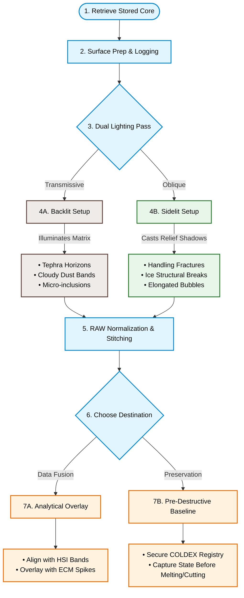

# Standardizing Quantitative Visual Stratigraphy for Digital Archiving of Ice Cores

**Authors:** Gary Hoehne, Grayton Simanson  
**Advisors:** Richard Nunn, Curt LaBombard  
**Affiliation:** NSF Ice Core Facility / Center for Oldest Ice Exploration (COLDEX)  
**Target Material:** Core AH2416 (26-meter core, Allan Hills 2024 Season)  

---

## 📂 Conference Resources
* 📄 **[Download Full-Resolution Digital Poster (PDF)](COLDEX_AllanHills_Poster.pdf)**
* 💼 **[Connect with [Your Name] on LinkedIn](https://linkedin.com)**
* 💼 **[Connect with Grayton Simanson on LinkedIn](https://linkedin.com)**

---

## 📝 Introduction
Ice cores preserve continuous records of past environmental and climatic conditions through variations in ice structure, chemistry, and physical properties. Visual stratigraphy represents one of the most fundamental datasets collected from an ice core, documenting features including annual layering, bubble distribution, fractures, dust horizons, melt features, and other englacial structures. These observations provide important context for interpreting complementary measurements, including electrical conductivity measurements (ECM), stable isotope analyses, geochemical measurements, and hyperspectral imaging (HSI).

Despite its importance, standardized high-resolution visual documentation is not consistently available for archived ice cores, limiting opportunities for future analysis and integration with emerging analytical techniques. While advanced methods such as ECM and HSI provide valuable physical and spectral characterization, these approaches require specialized instrumentation and resources that may not be available at all ice core repositories.

This workflow presents a low-cost, reproducible approach for digitally documenting ice cores using commercially available digital photography equipment and open-source image processing software. The workflow was developed using archived ice core AH2416 from the Allan Hills Blue Ice Area, Antarctica, and integrates dual-illumination imaging, calibrated image acquisition, digital image processing, mosaic generation, and manual stratigraphic logging. The objective of this workflow is to provide a standardized framework for producing spatially continuous, depth-referenced visual records of ice cores that can support long-term digital archiving, visual interpretation, and future quantitative analysis.

---

## 📊 Workflow Architecture

---

📬 *Interested in adapting this low-cost setup for your own repository or field season? Feel free to contact us or reach out during the poster session!*
