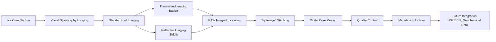
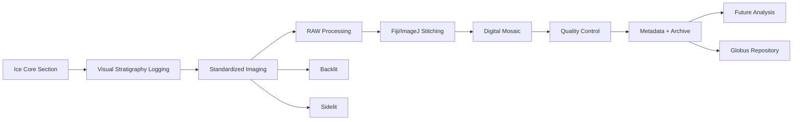

# Standardizing Quantitative Visual Stratigraphy for Digital Archiving of Ice Cores

## Project Overview

This repository documents the development of a low-cost, reproducible workflow for creating high-resolution digital visual stratigraphy records of ice cores.

The workflow integrates standardized digital photography, RAW image processing, image stitching, manual stratigraphic logging, and metadata documentation to create depth-referenced digital archives suitable for long-term curation and future scientific analysis.

The workflow was developed using archived ice core sections from the Allan Hills Blue Ice Area, Antarctica, and is designed to be transferable to both archived and newly collected ice cores.

---

## Project Information

**Authors**  
Gary Hoehne  
Grayton Simanson  

**Advisors**  
Richard Nunn  
Curt LaBombard  

**Development Dataset**  
AH2416 — Allan Hills Blue Ice Area, Antarctica  

**Program**  
NSF COLDEX Research Experience for Undergraduates (REU)

---

# Workflow Overview

---

# Conference Resources

## Poster

📄 **Full-Resolution Digital Poster (PDF)**  
[https://github.com/HoehneG1/Ice-Core-Imaging-Workflow/blob/main/COLDEX%20REU%20Poster_Hoehne.pdf]

## Workflow Documentation

📄 **Complete Imaging and Processing Workflow (PDF)**  
[Insert workflow PDF link here]

---

# Repository Contents

This repository contains:

📁 **docs/**  
- Complete visual stratigraphy workflow documentation  
- Imaging and processing methods  

📁 **figures/**  
- Workflow diagrams  
- Example mosaic products  

📁 **templates/**  
- Visual stratigraphy logging templates  
- Metadata templates  

📁 **examples/**  
- Example processed mosaics  
- Example visual stratigraphy products  

---

# Workflow Summary

The workflow consists of:

1. Standardized ice core preparation and imaging
2. Dual-illumination photography:
   - Transmitted (backlit)
   - Reflected (sidelit)
3. RAW image processing and calibration
4. Image stitching and digital mosaic generation
5. Visual stratigraphy documentation at 1 mm resolution
6. Quality control and metadata preservation
7. Preparation for long-term archival and future analysis

---

# Future Applications

The resulting digital visual stratigraphy records provide a foundation for integration with additional ice core datasets, including:

- Hyperspectral imaging (HSI)
- Electrical conductivity measurements (ECM)
- Stable isotope measurements
- Geochemical analyses
- Automated image-based feature detection

---

# Contact

Gary Hoehne  
LinkedIn: [https://www.linkedin.com/in/ghoehne/]

Grayton Simanson  
LinkedIn: [https://www.linkedin.com/in/gray-simanson-600a13217/]

Although developed using AH2416 from the Allan Hills Blue Ice Area, Antarctica, the workflow is designed as a transferable framework for both archived and newly collected ice cores.

📬 *Interested in adapting this low-cost setup for your own repository or field season? Feel free to contact us or reach out during the poster session!*

